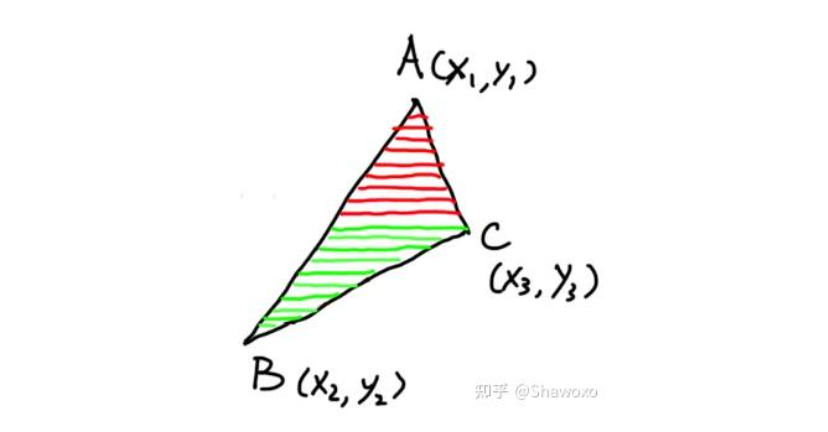

# 基于C++从零实现软件实时渲染管线（未使用任何图形API）（待重构）

实现以下功能：

1. 自定义Vector2、3、4、Matrix等数据结构及其相关成员函数
2. 使用相关GDI API，用Windows窗口呈现渲染效果
3. 使用BackBuffer实现缓冲区绘制
4. 使用DDA算法实现线段的绘制
5. 实现自己的MVP变换矩阵，能够将顶点从世界空间到屏幕空间
6. 实现自定义的相机控制，并绘制立方体进行观察。
7. 用纯色填充立方体(扫描线算法、重心插值)
8. 利用ZBuffer实现深度测试，从而实现有正确遮挡关系的立方体渲染
9. 基于视锥体的三角形裁剪
10. 实现三角形背面剔除(不剔除、顺时针剔除、逆时针剔除)
12. 使用Phong-shading着色频率，增加Blinn-Phong光照模型
13. 增加材质贴图
14. 实现透视矫正

------

### 自定义数据结构

- Vector2/3/4：
  - 成员变量：根据维度数确定。
  - 成员方法：
    - 加法、减法、数乘、相等判断等操作符自定义。
    - 点积、叉积、归一化、计算长度等这些在后面都有大量用到。
    - 转矩阵方法：因为对向量的矩阵变换都需要先把向量转换成矩阵。
- Matrix：
  - 成员变量：使用二维数组存储矩阵内的数据；还需定义行数和列数，在进行矩阵的计算时会用到。
  - 成员方法：
    - 加法、减法、数乘、矩阵乘法等操作符自定义。
    - 矩阵的转置，进行视角变换的时候有用到。
    - 这里没有用到矩阵的逆，所以我没有定义。其实在视角变换时用到了，但是旋转矩阵是正交矩阵，矩阵的逆等于矩阵的转置，所以直接用矩阵的转置就好。
- Vertex：顶点需要保存光栅化中所需要的信息：
  - 顶点的坐标。
  - UV坐标：用来施加材质贴图。
  - 法线向量：用来计算基于像素的光照。
  - 世界位置：这里是Blinn-Phong模型中高光的计算需要(需要视线方向 = 像素世界位置 - 相机位置)。
- MyColor：自定义的颜色类
  - 成员变量：三个float变量分别代表red、green、blue。
  - 自定义颜色类可以比较自由的实现颜色的加减乘除赋值等操作。

### 使用GDI API在Windows窗口内绘制

- 由于之前并没有GDI使用经验，所以此项目直接使用的Visual studio的Windows窗口模板。
- 注意事项：
  - 模板默认的是用GetMessage函数从消息队列中检索消息的。如果没有消息，线程会阻塞，直到新的消息到达。所以它并不适用实时渲染，我们需要保证画面不停的被渲染。
  - 使用的是PeekMessage来从消息队列中检索消息，此函数不会阻塞队列，但是不能被当作while的跳出条件，否则当消息队列中没有消息会跳出while循环从而终止渲染操作。所以需要自定义跳出条件。

### 使用BackBuffer

- BackBuffer的原理：顾名思义，将每个像素的信息都绘制在后缓冲区里，之后通过StretchDIBits函数交换到hdc上显示，之后在帧显示结尾清空BackBuffer()。
- 创建一个屏幕像素长度乘以宽度的一维数组当作BackBuffer就好。这样在内存中是连续的，访问速度快。

### 使用DDA算法实现线段的绘制

- DDA算法比较简单：选取线段两点x差值和y差值较大的一个作为分割频率(也是for循环的循环次数)，将x差值和y差值等分，每循环一次化画一点点。

### 定义相机类，实现相机控制

- 定义一个相机需要三个要素：位置、视线方向、相机上方向
  - 位置和视线方向只需要根据初始值计算就好；相机上方向需要利用坐标轴和相机的视线方向计算。
  - 
- 在消息回调函数中添加按键事件来更新相机的信息，实现相机的平移和旋转。
- 除此之外为了便于修改相机的旋转，我又添加了相机的世界旋转信息pitch、yaw、roll(貌似不加更合理，有控制指令输入时，直接更新视线方向就好)。

### 实现MVP变换矩阵

- M：Model变换——将物体从局部坐标转变为世界坐标。这里只考虑单个物体的情况，所以直接用的世界坐标，所以省略了这一步。

- V：View变换——从世界坐标转换为相机坐标。

  - 原理：

    - 首先，规定在右手坐标系中，摄像机永远是朝着-Z方向看的(左手坐标系就是Z)。其次，所有的旋转操作默认都是以坐标系原点为中心旋转的。
    - 所以，对于相机的控制操作，先做平移将相机平移到中心，再做旋转，使相机旋转某个角度。注意，这里不能写成齐次矩阵，因为应用齐次矩阵时相当于先应用旋转再应用平移，但是这里是需要先平移的。
    - 由于相机移动了，但是为了让成像不变，所有物体需要与相机做相同的变换。
    - 

  - 操作：

    - 理论上，应该把整个世界的物体和相机做相旋转到对齐世界坐标轴的位置，但是这样并不好做:

      

    - 但是，我们将标准坐标轴旋转到相机的角度的旋转矩阵却很好求，之后我们再对这个旋转矩阵取逆矩阵，然后再应用到相机上，就可以把相机旋转到标准坐标轴的位置。(前面提到，旋转矩阵的逆矩阵等于它的转置矩阵)

    - 

- P：投影变换—— 取视锥体内的物体并近大远小进行压缩。

  

  - 原理，如图所示，定义近平面和原平面，将两个平面形成的视锥体内的物体，将远平面压缩到近平面大小。此时压缩后的视锥体变成了长方体，再将此长方体做透视除法，映射到NDC空间。

    

  - 实际操作：
    - 注意矩阵内的近平面和远平面的值正负性。此项目中的z_near和z_far都是使用的坐标值，也就是负值。所以之后的所有边界条件判定都需要与之匹配(手动计算一下临界值以及左右的符号就好)。
    - 其次，虽然由于是负值导致看起来z_near > z_far，但是实际上映射到NDC时，是z_near 映射为 -1，z_far映射为1。

- 视口变换：

  - 这一步是把NDC拉长到屏幕大小，并把X, Y坐标对应到屏幕的像素坐标。至于Z坐标要保存起来，后面用于深度测试。

------

### 阶段成果

到这一步已经可以实现如下图的效果了(我在这里还没有实现backbuffer，是直接在hdc上绘制的)：

- 相机的控制(这里的物体是保持不动的，移动的是相机)
- 顶点的正确透视计算
- DDA算法画线将各个顶点连接起来描绘出线框

------

### 用纯色填充立方体(扫描线算法、重心插值)

- 这一步开始到添加材质贴图之前，需要暂时给Vertex添加颜色变量。

- 接下来，在屏幕空间中，通过**扫描线算法**确定在每个三角形内的像素点，再使用重心坐标插值计算像素点的具体颜色。

  - 扫描线画法：将三角形分为上下两段，从下到上扫描，每次从左边的边开始扫描到右边的边为止。

    

  - 重心插值：搜一下重心插值公式就好了，这里不多做介绍了，比较简单。

    

    

### 实现深度测试

- 原理：利用转换到屏幕空间的Z坐标，判断重叠的像素点，如果离屏幕更近就覆盖当前的颜色。

- 实现：

  - 维护ZBuffer来存储每个映射到屏幕空间的点的Z坐标(深度)。
  - 也就是说ZBuffer也要是一个屏幕长度乘以宽度的长度的数组，来存储z坐标值。注意这里的Z坐标值一定要是**NDC中的Z坐标**，如果用裁剪空间和世界空间的都是错的。

- 完成这一步后可以实现以下效果：

  

### 基于视锥体的三角形裁剪

- 前提：该操作要在裁剪空间中进行。确切的说是经过MVP之后，但是透视除法之前。

- 原理：有些三角形在超出视锥体的范围之后，需要做一些裁剪操作。主要分为以下几种情况：

  - 超出远平面或者上、下、左、右平面的三角形：当三角形三个顶点全部在范围之外的时候，全部剔除该三角形，不进行渲染。其余的时候在对像素点进行着色的时候不进行渲染就好了(暂时不考虑巨大三角形的剔除——即顶点在外面，但是三角形内部在视锥体里的情况)

  - 有两个顶点超出近平面：这种情况直接把三角形截断，取两条边与近平面的交点作为三角形的两个新顶点就好了。这里就不配图了（懒得画了，后期有空补上）

  - 有一个顶点超出近平面：这种情况截断三角形之后，留下的是一个梯形，那么就要新生成两个三角形，看图就明白了。

    

- 注意事项：

  - 新生成的三角形的顶点时针顺序要与原三角形保持一致。例如上图：如果原三角形是ABC，那新三角形就得是P1-B-C, P1-P2-B这样。
  - 对于边界条件的判定最好手动算一遍。且因为这是在齐次坐标空间下的裁剪，所以与近平面的交点的计算需要注意：在近平面上的点Z + W = 0。因为变换到NDC时，做透视除法时，近平面的Z坐标被除以了W变成了-1，所以 Z / W = -1 ===》Z + W = 0。

### 实现三角形背面剔除(不剔除、顺时针剔除、逆时针剔除)

- 原理：
  - 计算三角形的朝向，剔除所有背对着镜头(也就是法线向量与视线方向点积结果为正)的三角形，从而节约计算性能。
  - 在NDC中进行。
  - 
- 操作：可以看到有三种剔除顺序
  - 不剔除：顾名思义，什么都不做，全部渲染。
  - 顺时针剔除：顺时针读取三角形的顶点，再做叉乘得出法线向量。
  - 逆时针剔除：逆时针读取三角形顶点，再做叉乘得出法线向量。
  - 可以看出顺时针和逆时针的结果刚好是相反的，这也就可以适应不同的三角形顶点顺序。
- 效果：
  - 剔除前：
  - 
  - 剔除后：
  - 

### 基于Phong-Shading，添加Blinn-Phong光照模型

- Blinn-Phong：像素点的光照值 = 漫反射光 + 高光 + 环境光

  - 漫反射光：与光的入射角度有关，与视线方向无关。这里的kd用光照前的颜色就好。
  - 
  - 高光：
    - 需要利用视线方向与法线方向计算。其实就是相当于镜面反射，当视线方向与光的出射方向越重合，高光就越亮。(*视线方向需要用像素点的世界位置减去相机位置，所以这里要插值计算像素点的世界位置，同样需要**透视矫正***)。
    - 另外，对于计算出的COSα值会被乘以指数次，指数越高，高光的可视范围就越小。
    - 这里的ks我采取的是白色，模拟太阳光的反光。
  - 
  - 环境光：这里就是一个常数值，代表各种各种样的、经过多次反射的、照到该位置的光的叠加。
  - 
  - 叠加之后的效果如下
  - 

- Phong-Shading：一种着色频率，基于像素的着色，即会对每个像素都计算一次光照。

  - 原理：对顶点的法线向量求插值，然后每个像素点再根据插值求得的法线向量计算光照。

  - 注意：*这里的法线向量的插值需要进行**透视矫正***(文章最后)。

    

  - 另外两种着色频率：

    - 基于三角形的着色频率，每个三角形内的颜色都一样，按三角形着色。

      

    - 基于顶点的着色，即把顶点的颜色都计算好，再插值颜色。

      

  - 顶点法向量的计算：一般来说obj文件中会给出顶点的法线向量，但是这里还是说明一下该怎么计算。

    - 计算方法：取所有引用该顶点的三角形的法线向量的加权平均值(以三角形面积加权)。

      

### 添加材质贴图

- 原理：用重心插值顶点的UV坐标，计算出每个像素点的UV坐标，再在材质贴图中读取对应的RGB颜色。

- 这里的UV坐标的计算，需要进行透视矫正。

  

### 透视矫正

- 透视矫正的原因：重心插值时，使用的是屏幕空间中的坐标，这些坐标已经经过了透视变换，原本的多边形的重心在屏幕空间中可能已经发生了变换。所以为了使插值后的结果正确，需要将计算后的坐标还原，还原成透视变换前的坐标。

  

- 具体方法：

  - 还记得在透视变换后，NDC之前，有一步透视除法。这一步就是使不同远近的物体根据距离呈现出不同的压缩成度。所以在这里为了适应透视除法之后的NDC坐标，我们需要把所有想插值的参数都进行除以深度信息W的操作。但是W也是线性变换的，所以首先需要插值计算1/W，再进行参数的插值计算，详见以下公式：
  - 

- 原理详见下文：

  - 图形学 - 关于透视矫正插值那些事 - Shawoxo的文章 - 知乎
    [https://zhuanlan.zhihu.com/p/403259571](https://zhuanlan.zhihu.com/p/403259571)

------

### 最终效果：

到这里，与上一个阶段相比，又添加了材质贴图、Blinn-Phong光照、三角形裁剪、背面剔除、深度测试功能。最终可以实现如下效果：

![Desktop 2025.01.24 - 17.38.23.01.mp4 [video-to-gif output image]](images/ezgif-1a31f89df1290.gif)

# 总结（复习）

###  齐次坐标的引入

- 加多一维，为了统一平移操作
- 齐次矩阵的作用顺序：先应用线性变换，再平移

### 透视投影

- 透视投影"挤压"过程：近平面所有点不变，远平面Z坐标不变、中心点不变
- MVP：视角空间 -> 裁剪空间，之后做三角形裁剪
- 透视除法：裁剪空间 -> NDC空间，之后做光栅化

### 光栅化

- 判断哪些像素点需要亮起
- 判断像素是否在三角形内时，减少判断像素点数量的方法
  - 包围盒(bounding box)
  - 
  - 左右端扫描
  - 

### 光照模型

- Blinn-Phong光照 = 高光(闪亮的区域) + 漫反射(光照角度与平面法线的夹角有关) + 环境光(统一给一点微弱的亮度)

### 顶点着色器

- 读取顶点的各种信息（坐标、uv坐标、顶点法线等），对坐标进行MVP变换

### 光栅化

- 计算哪些像素点该亮，并进行透视矫正

### 片元着色器

- 读取纹理颜色，计算并添加光照，确定像素最终的颜色。

### 三角形重心坐标

- 使用重心坐标插值三角形的各种属性
- 应该用投影变换之前的坐标进行插值，这一步是在光栅化中进行的，但是光栅化的时候坐标已经进行过了MVP变换，用现在的坐标插值是不对的，那么此时就需要透视矫正，把坐标变回透视投影之前的坐标计算各种属性的插值。

### 空间变化

- 
